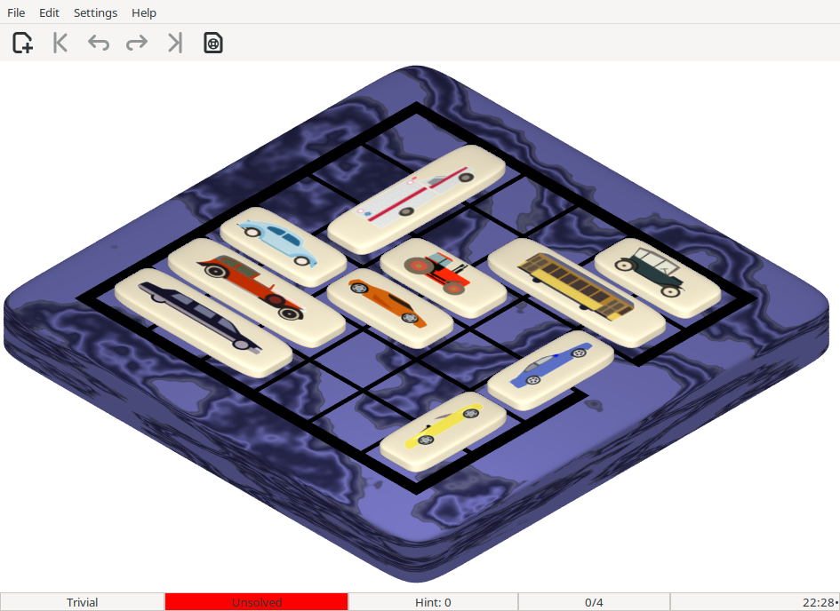

# PyTraffic

A Python implementation of the sliding puzzle board game **Rush Hour**, invented by
[Nob Yoshigahara](https://en.wikipedia.org/wiki/Nob_Yoshigahara) and commercialised
by Binary Arts Corporation.



---

## About

PyTraffic was originally written by **Michel Van den Bergh**
(michel.vandenbergh@uhasselt.be, Hasselt University) and released in the early 2000s.
It was inspired by [Gtraffic](https://directory.fsf.org/wiki/Gtraffic), a GNOME version
of Rush Hour, and superseded TTraffic, an earlier Tcl/Tk version.

This repository contains **version 3**, a port to Python 3 and GTK 3 (PyGObject), with
a full modernisation pass carried out with the assistance of
[Claude](https://www.anthropic.com/) (Anthropic AI). The game logic, puzzles, themes,
and solver are Michel's original work; the porting and modernisation work is described
in the git history.

---

## The Game

The goal is to slide the **red car** out through the slot on the right side of the 6×6
grid. Horizontal cars can only move left/right; vertical cars can only move up/down.
You must manoeuvre the other vehicles out of the way.

PyTraffic comes with roughly **19,000 pre-computed puzzles** in three difficulty levels
(Intermediate, Advanced, Expert), plus Trivial and Easy levels generated on the fly —
suitable for young children.

### Features

- Multiple **themes**, including a 3D-rendered DeLuxe theme and several 2D styles
- **Hint system** — finds the best move in any position via exhaustive graph search
- **Demo mode** — plays through the optimal solution automatically
- **Undo/redo** and move history
- **Statistics** tracking per difficulty level
- **Background music** support (ogg, mp3, wav, flac via GStreamer)

---

## Requirements

| Dependency | Notes |
|---|---|
| Python ≥ 3.8 | |
| PyGObject (gi) | GTK 3 bindings — `python3-gobject` on most distros |
| GTK 3 | Usually pre-installed |
| GStreamer + plugins | For sound effects and music playback |
| gcc | Only needed to build the C solver extension |

On Fedora/RHEL:
```
sudo dnf install python3-gobject gtk3 gstreamer1-plugins-base gstreamer1-plugins-good python3-devel gcc
```

On Debian/Ubuntu:
```
sudo apt install python3-gi gir1.2-gtk-3.0 gstreamer1.0-plugins-good python3-dev gcc
```

---

## Installation

### From source

```bash
git clone https://github.com/voyageur/pytraffic.git
cd pytraffic
pip install .          # builds the C solver extension and installs
pytraffic              # run
```

Or build the extension in-place for development:

```bash
python setup.py build_ext --inplace
python Main.py
```

### Running without installing

```bash
python setup.py build_ext --inplace
python Main.py
```

---

## Configuration

PyTraffic stores its settings in `~/.pytraffic`. To reset everything to defaults,
simply delete that file.

---

## How the hint system works

For a given board configuration, PyTraffic constructs a graph of **all reachable
positions** and a hash table for O(1) lookup. A standard breadth-first search then
assigns every node its minimum distance to any winning position (red car escaped).
This gives the optimal move at every step.

The 19,000 pre-computed "interesting" puzzles (≥ 20 moves to solve) were generated by
exhaustive search over all valid board configurations. Generating them took around 60
hours on a Dell P600 in 2001; the solver itself runs in ~30 ms per level on modern
hardware.

---

## Resetting a solved level

After solving a level, you can replay the optimal solution: press **Restart**, then
repeatedly press **Hint** (or enable demo mode from the Edit menu).

---

## Acknowledgements

- **Nob Yoshigahara** — inventor of Rush Hour
- **Binary Arts Corporation** — original commercialiser of the board game
- **Michel Van den Bergh** — original author of PyTraffic (versions 1–2.5.x)
- The authors of Python, GTK, PyGObject, GStreamer, GIMP, Inkscape, and the
  many other free tools used in the creation of this game
- **Anthropic Claude** — assisted with the Python 3 / GTK 3 port (v3)

---

## License

GNU General Public License v2 or later. See [COPYING](COPYING).
